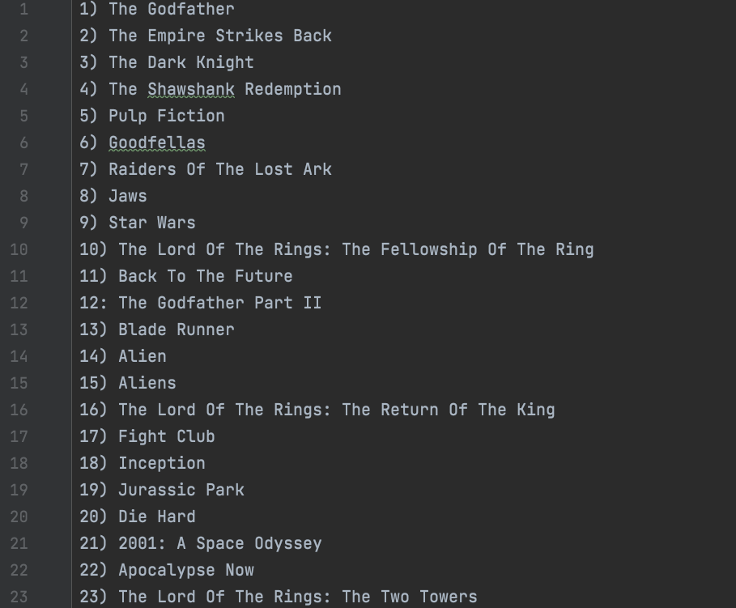
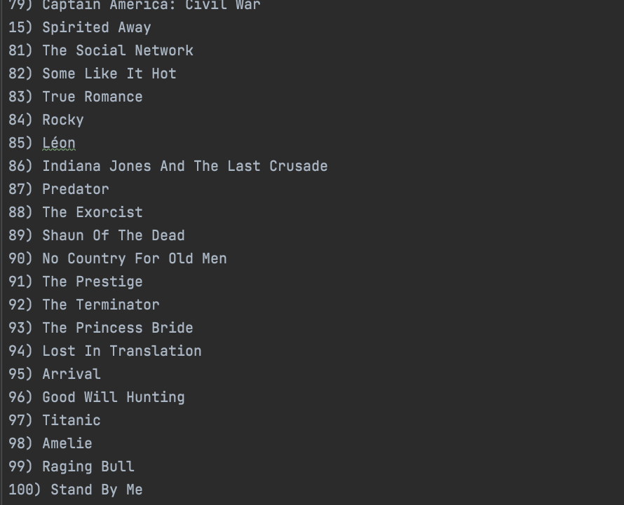

# 100_movies_to_watch
# 100 Movies to watch  List of top 100 movies to watch in lifetime made with help of scraping the Empire Website  ## Table of contents - [Overview](#overview)   - [Screenshot](#screenshot)   - [Links](#links) - [My process](#my-process)   - [Built with](#built-with)   - [What I learned](#what-i-learned)   - [Useful resources](#useful-resources) - [Author](#author) - [Acknowledgments](#acknowledgments)  ## Overview  ### Screenshot    ### Links - Github Repository:   ## My process  ### Built with - Python 3 - Beautiful Soup   ### What I learned - Beautiful Soup code snippets   - ```     empire_web_page = response.text     soup = BeautifulSoup(empire_web_page, "html.parser")     movie_titles = soup.find_all(name="h3", class_="title")     ``` - Web scraping  - Writing and Reading files using python   ### Useful resources - [Stack Overflow](https://stackoverflow.com/) - [Google](https://www.google.com/)  ## Author  - Website - [Yash Viradia](http://yashviradia.tech/) - Twitter - [@theyashviradia](https://twitter.com/theyashviradia)  ## Acknowledgments - [LondonAppBrewery](https://www.londonappbrewery.com/) - [Empire](https://www.empireonline.com/movies/features/best-movies-2/)
